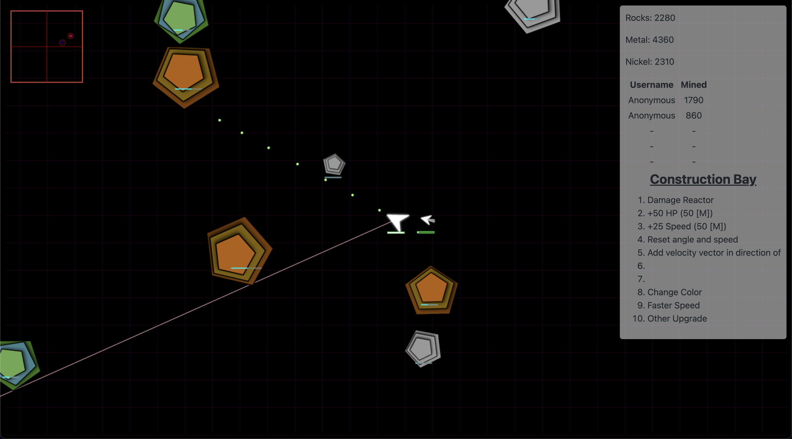

<h1 align="center">
    IOgameAttemp1a <small><i>(Pending better name)</i></small>
    <br>
    <br>
     <br />
    An Example .io Game Fork
</h1>
<h4 align="center">
  A fork from <a href="https://example-io-game.victorzhou.com" target="_blank">https://example-io-game.victorzhou.com</a>
</h4>

An example multiplayer (.io) web game. Read the walkthrough: [**How to Build a Multiplayer (.io) Web Game**](https://victorzhou.com/blog/build-an-io-game-part-1/).

Built with [Node.js](https://nodejs.org/), [socket.io](https://socket.io/), and [HTML5 Canvas](https://www.w3schools.com/html/html5_canvas.asp).

To see this code with [Flow](https://flow.org/) typing, visit the [flow branch](https://github.com/vzhou842/example-.io-game/tree/flow).

## Development

To get started, make sure you have Node and NPM installed. Then,

```bash
$ npm install
$ npm run develop
```

on your local machine.

To run the project in a production setting, simply

```bash
$ npm install
$ npm run build
$ npm start
```

## Tests

To run the tests for this this project, simply

```bash
$ npm install
$ npm test
```
